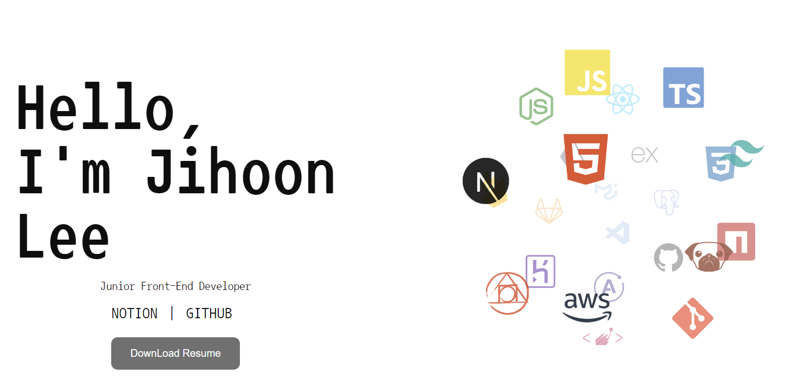
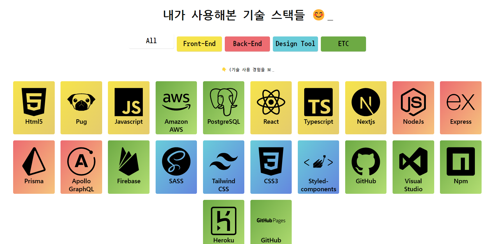

# JiPortFolio

## 배포사이트 : https://jiportfolio.netlify.app/

   
  
  
   

## 프로젝트 소개

jiPortFolio 사이트는 앞으로 컴퓨터 개발을 하면서 모든것을 기록하기위한 저만의 사이트입니다.  
현재는 프로젝트 부분이나 이력서 등등 개선해야할 부분이 많지만  
계속해서 가꿔나가 더 이쁘고 꽉찬 사이트를 만들고싶습니다

 

## 기술 스택

| JavaScript |  React   | Styled-Components |
| :--------: | :------: | :---------------: |
|   ![js]    | ![react] |      ![node]      |

 

## 구현 기능

### 기능 1 : 메인화면에 3d 를 이용해 tool로 이루어진 구 만들기

### 기능 2 : 내가 사용해본 tool 에 대한 소개 로직 만들기

### 기능 3 : 내가 누군지에 대한 텍스트 효과창 만들어보기

### 기능 4 : 전체적인 화면 로직 계획하고 구현해보기

 

## 배운 점

- 자바스크립트를 이용한 프로젝트로서 기술적 부분보다는 스타일적 요소에 치중했다  
- 스타일적인 부분을 가볍게 생각했지만 반응형, position 등등 생각해볼 부분이 많다는 것을 알았다.  
   

## 아쉬운 점

- 프로젝트 부분이랑 이력서를 채워보고싶다

 

## 라이센스

MIT &copy; [NoHack](mailto:lbjp114@gmail.com)

<!-- Stack Icon Refernces -->

[js]: ./public/javascript.png
[react]: ./public/react.png
[node]: ./public/styled.png
